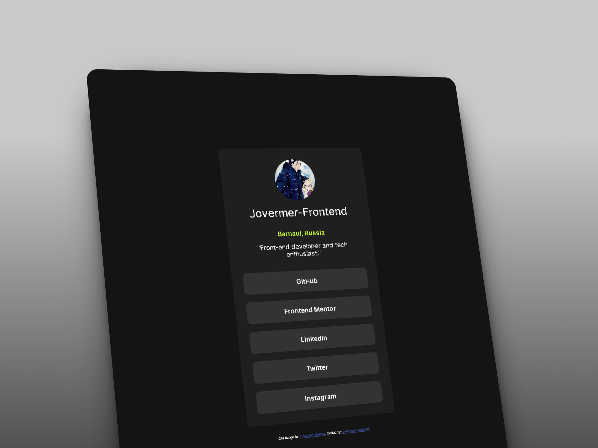

# Frontend Mentor - Social links profile solution

This is a personal, pixel-perfect solution to the [Social links profile challenge on Frontend Mentor](https://frontendmentor.io). Frontend Mentor challenges help you improve your coding skills by building realistic projects.

## Table of contents

- [Overview](#overview)
  - [The challenge](#the-challenge)
  - [Screenshot](#screenshot)
  - [Links](#links)
- [My process](#my-process)
  - [Built with](#built-with)
  - [What I learned](#what-i-learned)
  - [Continued development](#continued-development)
  - [Useful resources](#useful-resources)
- [Author](#author)

## Overview

### The challenge

Users should be able to:
- See hover and focus states for all interactive elements on the page
- Experience a fully responsive layout optimized for any screen size (from 320px up to 4K displays)
- Benefit from accessible markup designed for screen readers

### Screenshot



### Links

- Solution URL: [Add your Frontend Mentor solution URL here](https://www.frontendmentor.io/profile/matvejbezvodinskih642-create)
- Live Site URL: [Add your GitHub Pages live site URL here](https://jovermer-frontend.github.io/social-links-profile-main/)

## My process

### Built with

- Semantic HTML5 markup
- CSS3 Custom Properties (Variables)
- Flexbox Architecture
- BEM (Block Element Modifier) Methodology
- CSS Logical Properties (`inline-size`, `block-size`, `padding-inline`, etc.)
- Fluid Typography via `clamp()`
- Mobile-first approach

### What I learned

During this challenge, I focused heavily on writing production-ready, clean, and scalable CSS. 

1. **CSS Logical Properties & Modern Layouts:**
   Instead of using legacy physical properties (`width`, `height`), I integrated logical properties to ensure the layout remains robust across different writing modes and text directions:
   ```css
   .social-profile__card {
       display: flex;
       flex-direction: column;
       align-items: center;
       inline-size: 32rem;
       max-inline-size: 100%;
   }
   ```

2. **Semantic List Architecture for Navigation:**
   To guarantee high accessibility (A11y), social links were structured as an unordered list (`<ul>`), converting standard `<a>` tags into fully clickable block-level components for better UX:
   ```html
   <ul class="social-profile__list">
     <li class="social-profile__item">
       <a href="#" target="_blank" rel="noopener noreferrer" class="social-profile__link">GitHub</a>
     </li>
   </ul>
   ```

3. **Accessibility and User Preferences:**
   I implemented dedicated support for users who prefer reduced motion, disabling transitions globally when requested by the operating system:
   ```css
   @media (prefers-reduced-motion: reduce) {
       .social-profile__link {
           transition: none;
       }
   }
   ```

### Continued development

In my upcoming projects, I aim to focus on:
- Advanced responsive design structures using CSS Grid.
- Automating Visual Regression (Pixel-Perfect) testing via modern automation tools.
- Integrating build tools like Vite into my daily development workflow.

### Useful resources

- [MDN Web Docs - CSS Logical Properties](https://mozilla.org) - An incredible guide that helped me completely ditch physical widths and heights.
- [PerfectPixel Browser Extension](https://welldonecode.com) - This tool was vital in achieving a 100% pixel-perfect match with the original design.

## Author

- Frontend Mentor - [@Jovermer-Frontend](https://www.frontendmentor.io/profile/matvejbezvodinskih642-create)
- GitHub - [Your GitHub Username](https://github.com/jovermer-frontend)
